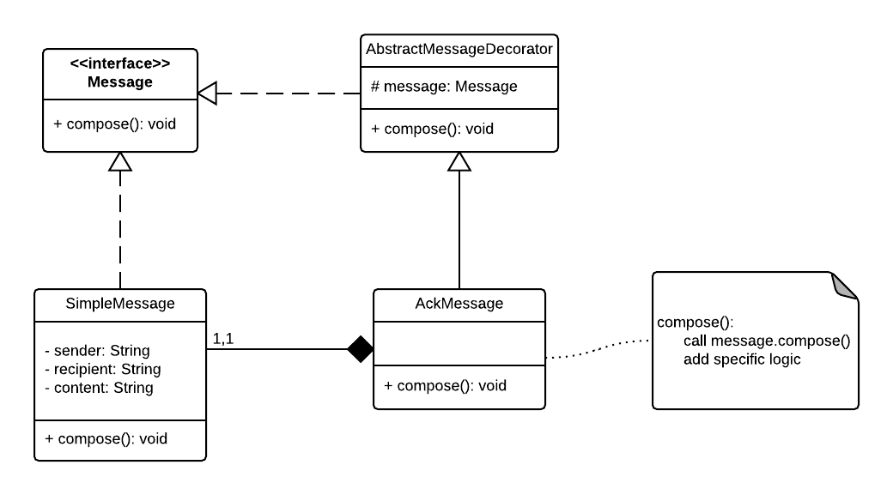

### Decorator pattern

#### A structural pattern

Extend the behavior of an  object at runtime, using the precept of "composition over inheritance"

Source code stems from the following UML diagram:

